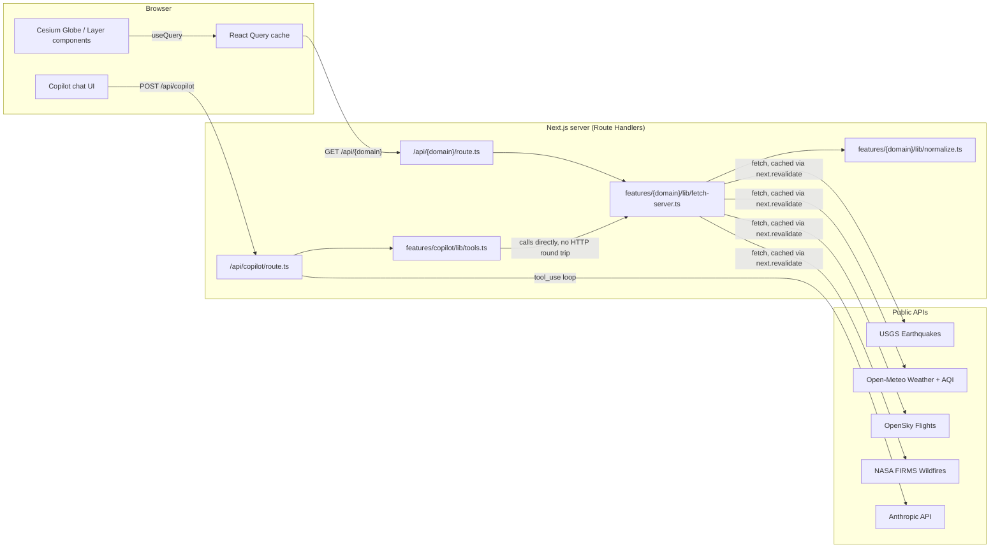

# Architecture

## Data flow

Every live data domain follows the same shape, so there's one pattern to understand rather than five:

The key decision: `fetch-server.ts` is the single source of truth for "how do we get and normalize domain X's data." The Route Handler calls it to serve the map's polling requests; the copilot's tool executors call the *same function* directly (no self-fetch over HTTP) so both surfaces are always answering from identical data.

## Client state

Two orthogonal state layers, deliberately not merged:

- **React Query** owns server data (quakes, weather, flights, AQI, wildfires) — polling intervals, staleness, and caching are all React Query's job.
- **`GlobeUiContext`** (`features/globe/context/globe-ui-context.tsx`) owns UI state that has nothing to do with server data: which layers are toggled on, the currently selected entity (drives the side panel), and the camera's current bounds/height (read by the flights hook to decide whether to fetch at all).

Entity click routing is intentionally centralized in one file, `features/globe/components/global-click-handler.tsx`: a single `ScreenSpaceEventHandler` picks whatever's under the cursor, checks it against per-domain `Map<string, T>` refs (populated by each layer component as its query data arrives), and falls back to `camera.pickEllipsoid` for an arbitrary point when nothing was picked — that fallback is what makes "click anywhere for weather" work without a dedicated hit-target for every square degree of ocean.

## Why no separate backend

The original spec called for FastAPI + Celery + Redis + PostGIS. This build uses Next.js Route Handlers instead (plus Supabase for the one piece that genuinely needs a database — see below) — deliberately, not as a shortcut:

- Every live-data external API is free-tier-friendly and doesn't need a job queue to poll on a schedule — Next's own `fetch` cache (`next: { revalidate: N }`) does that per-route.
- The one feature that needs persistence (saved views) needs a database and auth, not a task queue or heavy geospatial aggregation — Supabase (Postgres + Auth in one managed service) covers that without standing up a separate Python service.
- One language for the app itself, one deploy target, one place to look for "how does data get from a public API to the globe."

## AI Copilot

The copilot is a server-side manual tool-use loop (`app/api/copilot/route.ts`), not the SDK's beta tool runner — deliberately, to avoid taking a beta dependency for a straightforward bounded loop (max 6 iterations). Each turn: call the model with the five tools defined in `features/copilot/lib/tools.ts` → if it requests a tool, execute it via the corresponding `fetch-server.ts` function and feed the JSON result back → repeat until `end_turn`. The system prompt explicitly tells the model to use tools rather than answer from training knowledge, since the whole point is that the tools return *live* data.

## Auth & saved views

The only feature that's gated: signed-in users can save the current camera position, layer toggles, and airline filter as a named view, and restore it later. Everything else stays fully public.

- **Auth**: Supabase Auth, magic-link (passwordless) sign-in. `src/lib/supabase/client.ts` (browser) and `server.ts` (Server Components/Route Handlers, cookie-based) follow the standard `@supabase/ssr` split. `src/proxy.ts` refreshes the session cookie on every request — Next.js 16 renamed the `middleware.ts` file convention to `proxy.ts`; same API, new filename.
- **Storage**: a single `saved_views` table (`supabase/migrations/0001_saved_views.sql`) with row-level security scoping every row to `auth.uid() = user_id` — enforced by Postgres itself, not application code, so a bug in the Route Handler can't leak one user's views to another.
- **Camera capture/restore**: `features/saved-views/lib/camera-state.ts` reads/writes Cesium's `Camera` (longitude, latitude, height, heading, pitch, roll) via a `cesiumRef` populated from inside the `<Viewer>` tree (`camera-bounds-watcher.tsx`) and exposed through `GlobeUiContext`, so the "Save" button — which lives in the HUD, outside the Cesium tree — can read and fly the camera imperatively.
