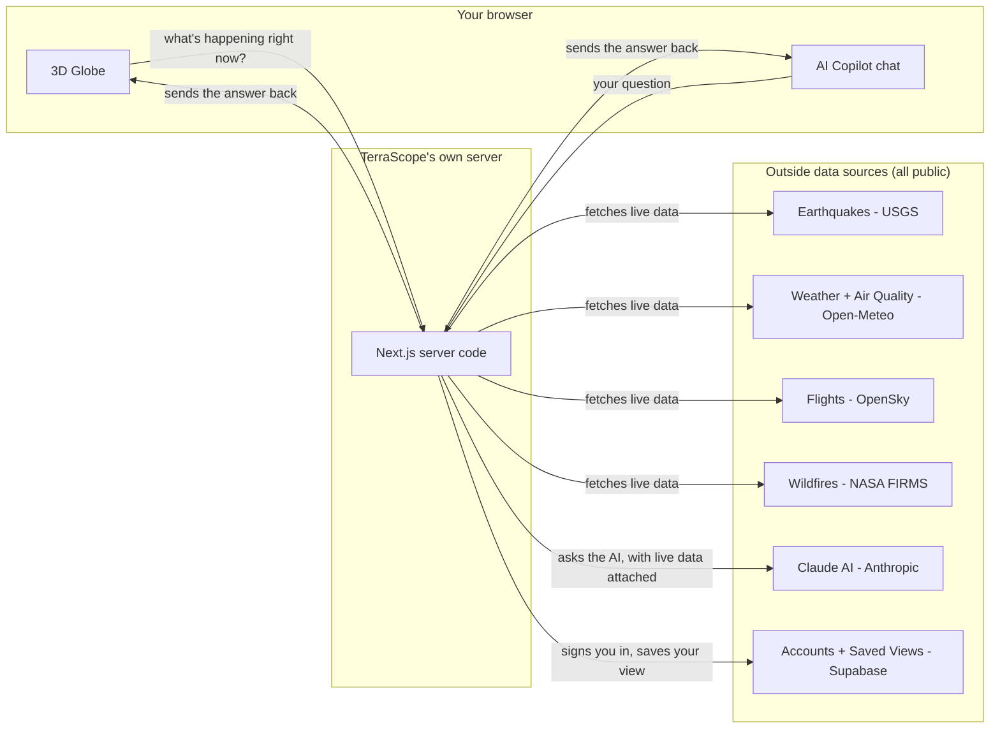

# TerraScope AI

### A real-time, 3D globe that shows you what's happening on Earth right now — earthquakes, weather, wildfires, air quality, and live flights — plus an AI assistant you can ask questions to.

> **New here and not a programmer?** This README is written for you too. Every technical term is explained the first time it shows up. Skip straight to [What is this, really?](#what-is-this-really) if you just want the plain-English version.

---

## Table of contents

1. [What is this, really?](#what-is-this-really)
2. [The idea — why this exists](#the-idea--why-this-exists)
3. [What it actually does, feature by feature](#what-it-actually-does-feature-by-feature)
4. [How it's built (architecture, in plain English)](#how-its-built-architecture-in-plain-english)
5. [Tools used, and why each one](#tools-used-and-why-each-one)
6. [Challenges faced while building it](#challenges-faced-while-building-it)
7. [What's deliberately not built](#whats-deliberately-not-built)
8. [Getting it running on your own computer](#getting-it-running-on-your-own-computer)
9. [Project structure](#project-structure)
10. [Roadmap — what's next](#roadmap--whats-next)

---

## What is this, really?

Imagine Google Earth, but instead of just showing you satellite photos, it's constantly watching the whole planet and pointing out things happening *right now*: an earthquake that just struck off the coast of Mexico, a wildfire burning in Australia, the exact live position of a British Airways flight over the Atlantic, or how polluted the air is in Beijing at this very moment.

That's TerraScope AI. You spin a 3D globe with your mouse, click on anything that interests you, and get real information pulled live from public data sources — not fake demo data, the actual real-time feeds that governments, scientists, and airlines use. There's also a chat assistant built in: you can literally type "how many earthquakes happened today?" and it will look up the live data and answer you like a knowledgeable analyst would.

It was built as a portfolio project — a way to demonstrate, in one working application, the kind of software a modern technology company (think Palantir, Google, or a big airline's operations center) would actually build and rely on.

---

## The idea — why this exists

The original brief for this project was ambitious on purpose: build something that looks and feels like a real commercial product, not a tutorial project or a template. Specifically, it needed to combine several things that don't normally appear together in a portfolio piece:

- A genuinely interactive **3D globe**, not a flat map
- **Multiple live data sources** stitched into one coherent experience
- A **conversational AI** that can actually answer questions using that live data
- **User accounts**, so people can save their own personalized setup
- Production-grade engineering practices: automated tests, a deployment pipeline, a Docker container, clean documentation

Rather than trying to build all of that blindly in one giant push, the approach here was deliberately **phased**: get one solid, fully-working slice built and verified first (the globe plus a few live data feeds), then layer in more capability on top of that solid foundation — one working feature at a time, each one tested before moving to the next. That's why, if you look at the commit history, you'll see the project grow in clearly labeled stages rather than arriving all at once.

---

## What it actually does, feature by feature

### 🌍 The 3D Globe
The centerpiece. A fully interactive, spinnable, zoomable 3D Earth rendered right in your browser — no plugins, no downloads. You can rotate it, zoom into a city, or pull back to see the whole planet at once.

### 🔴 Live Earthquakes
Every earthquake of magnitude 2.5 or stronger recorded anywhere in the world in the last 24 hours, shown as a colored dot on the globe — green for minor, yellow for moderate, orange for strong, red for major. Click any dot to see the exact magnitude, depth, location, and time, straight from the US Geological Survey (the U.S. government agency that tracks earthquakes worldwide).

### 🌤️ Live Weather
Real-time temperature, wind, humidity, and conditions for 20 major world cities, plus something more fun: **click anywhere on the globe** — the middle of the ocean, the Sahara, Antarctica — and it will fetch the actual current weather for that exact spot.

### 💨 Air Quality
How polluted the air is right now in major cities, using the same official scale (the "AQI," or Air Quality Index) that news apps and government health warnings use — from "Good" (green) to "Hazardous" (dark red).

### ✈️ Live Flights + Airline Filter
Real airplanes, currently in the air, shown at their actual live position and heading — pulled from the same kind of data feed that flight-tracking apps use. Zoom into a busy airspace (say, over Western Europe) and you'll see real aircraft moving in real time. You can also **filter by airline** — pick Qatar Airways, British Airways, Air India, Emirates, and 16 other major carriers to show only their flights among what's currently visible.

### 🔥 Wildfires
Active fire detections from NASA satellites, updated throughout the day, showing where fires are currently burning around the world and how intense they are.

### 🚨 Global Alerts
A small bell icon that quietly counts up genuinely serious events — major earthquakes (magnitude 5.5+) and intense wildfires — so you don't have to go hunting for them.

### 🤖 AI Copilot
A chat assistant, built into the app, that you can ask questions like *"summarize today's strongest earthquakes"* or *"is there a wildfire near Sydney right now?"* It doesn't guess or make things up — it actually looks up the live data (the same data powering the globe) before answering, the same way a human analyst would check a dashboard before giving you a briefing.

### 👤 Accounts + Saved Views
Sign in with just your email (no password to remember — you get a one-click "magic link" instead), and you can save your current globe setup — camera position, which data layers are turned on, which airlines you're filtering — as a named view, then jump back to it anytime. Nothing else in the app requires an account; this is the one optional, personal feature.

---

## How it's built (architecture, in plain English)

At a high level, there are three layers talking to each other:



The important idea: **your browser never talks directly to USGS, NASA, or any outside data source.** Every request goes through TerraScope's own server first. This matters for three reasons a non-technical reader can understand:

1. **Privacy/security** — your browser never needs to know any secret passwords or API keys; only the server does, and they never leave it.
2. **Reliability** — if an outside data source is briefly down or slow, the server can smooth that over instead of the whole app breaking.
3. **Consistency** — the AI chat assistant and the globe itself both go through the exact same server code to fetch data, so the assistant is always talking about the same information you're looking at on screen, never something different or stale.

---

## Tools used, and why each one

Every real product is a series of decisions about which building blocks to use. Here's what was chosen and, more importantly, *why* — including the tradeoffs.

| Tool | What it actually is | Why this one, not something else |
|---|---|---|
| **Next.js** | A framework that lets one project contain both "what the user sees" (the website) and "the behind-the-scenes server logic" (fetching data, talking to the AI, checking who's signed in) | Avoids needing two entirely separate projects (a frontend and a backend) glued together — less to build, less to keep in sync, one place to deploy |
| **React** | The library Next.js is built on, for building the visual interface out of reusable pieces ("components") | It's the industry-standard way to build interactive web interfaces; Next.js is built on top of it |
| **TypeScript** | JavaScript (the language of the web) with an extra layer that catches mistakes *before* the code ever runs, by checking that data is the shape you expect | Catches an entire category of bugs (like "expected a number but got text") automatically, before a user ever sees them |
| **CesiumJS** | A specialized library specifically for rendering a realistic, navigable 3D globe in a browser | It's the tool real geospatial/mapping companies use for this exact job — a flat map library (like the ones behind most "maps" on the web) can't do a true rotating 3D Earth |
| **Tailwind CSS** | A way of styling the visual look of the app (colors, spacing, glass/blur effects) directly alongside the layout code, instead of in separate stylesheets | Faster to build and change a consistent visual design across dozens of components without style rules scattered across many files |
| **TanStack React Query** | Manages "data that comes from outside and needs refreshing" — like earthquake data that should update every minute — including caching and automatic retries | Handles all the fiddly, error-prone parts of "fetch this, keep it fresh, retry if it fails" so that logic doesn't have to be hand-written and re-debugged for every single data feed |
| **Framer Motion** | Adds smooth animations — panels sliding in, numbers fading as they update | The difference between an app that feels "alive" and one that feels static; small motion touches are a large part of why the app doesn't look like a generic dashboard template |
| **Anthropic's Claude (AI)** | The actual AI model that powers the chat assistant | Claude supports "tool use" — meaning it can be given the ability to actually *call* the earthquake/weather/flight data functions itself and read real results, rather than just generating plausible-sounding text from memory |
| **Supabase** | A hosted service that provides user accounts (sign-in) and a database, without needing to build/run your own | Building a secure login system and a database server completely from scratch is a large, security-sensitive undertaking; Supabase provides a well-tested version of both for free at this scale |
| **Docker** | Packages the entire application — code plus everything it needs to run — into one self-contained unit that behaves identically anywhere | Guarantees "it works on my machine" also means it works on any other machine or server, because the whole environment travels with it, not just the code |
| **GitHub Actions** | Automatically runs the test suite, checks the code for errors, and confirms the app still builds correctly every time new code is pushed | Catches mistakes automatically before they can reach anyone using the app, without a human needing to remember to check manually every time |
| **Vitest** | The tool that actually runs the automated tests | Fast, and works well with the rest of the TypeScript/Next.js setup |

### Why *not* the originally-planned backend?

The very first version of this project's specification called for a separate Python server (using a framework called FastAPI), a task-scheduling system (Celery), and a dedicated database with geographic superpowers (PostGIS). That's a completely legitimate way to build something like this — many real companies do exactly that.

It was deliberately not built that way here, for a concrete reason: **at this stage, there's no heavy background processing or complex geographic querying actually happening** — every data feed is a straightforward "ask a public API for the latest data, hand it to the browser" operation. Adding a second programming language, a task queue, and a specialized database would have meant more moving parts to build, explain, and keep running, without doing any more for the actual product. If a future version needs real background jobs or heavy geographic analysis, that's the point where it would make sense to add that complexity — not before.

---

## Challenges faced while building it

Real projects don't go in a straight line. Here are the actual problems hit along the way, and how they were solved — kept in because a portfolio project that only shows the finished result hides the most interesting part of the work.

### 1. The globe "flickered" and looked broken after moving the project folder
Partway through, the whole project was moved to a cleaner folder location. Afterward, the app started flickering constantly in the browser and looked broken. The real cause turned out to be a **stale build cache** — Next.js's build tool (Turbopack) had saved internal references to the *old* folder location, and once that location no longer existed, it kept crashing and silently restarting in a loop, which showed up as flickering. The fix was simple once diagnosed: delete the cache folder and let it rebuild fresh. The lesson — a build tool's cache can become invisible "leftover state" from before a change, and needs to be told to start over.

### 2. Wildfires silently failed with the API key correctly set up
After getting a real NASA API key configured, the wildfires feature still crashed. The actual bug: the web address used to reach NASA's fire-data service had a typo — `firms.modaps.eosdis.gov` instead of the correct `firms.modaps.eosdis.**nasa**.gov` (missing the word "nasa"). It's an easy mistake to make and an easy one to miss, since the address *looks* plausible. Verifying it against NASA's own current documentation (rather than trusting memory) found and fixed it. It's now also protected so that if NASA's service is ever briefly unreachable in the future, the feature quietly shows "unavailable" instead of crashing the whole page.

### 3. The 3D globe library and React don't naturally get along
React (in development mode) deliberately mounts and un-mounts each part of the app once, on purpose, to help catch bugs. That's normally harmless — but the 3D globe library creates a real graphics context with the computer's graphics card (similar to what a 3D video game does) the moment it starts up, and doing that twice in quick succession can visually glitch. The fix was to turn off that specific double-check behavior for this app, since it's not useful for a graphics-heavy library like this one.

### 4. Working within free flight-tracking limits
The live flight data source is free to use, but only if you don't ask it for too much data too often — it's priced by how large an area you query, not by how many planes are in it. So instead of constantly asking "show me every plane on Earth" (which would exceed the free daily limit within an hour), the app only asks for flights in a small area around wherever the camera is currently pointed, and only when zoomed in reasonably close — a deliberate design constraint that shaped how the whole flights feature works, not an afterthought.

### 5. Next.js changed a core file convention mid-project
While building the accounts/sign-in feature, a file called `middleware.ts` (a standard, well-documented Next.js convention) turned out to have been renamed to `proxy.ts` in the exact version of Next.js this project uses — a very recent breaking change. Using the old name would have silently done nothing. This was caught by checking the actual current documentation bundled with the installed software, rather than relying on general knowledge that could have been slightly out of date.

### 6. Scoping an intentionally huge original idea
The original brief described, essentially, an entire company's worth of software: dozens of data types, a full backend team's infrastructure, and enterprise deployment tooling — realistically months of work for a team, not a single build session. The real challenge here wasn't any single line of code — it was continuously making honest, explicit calls about what to build now, what to defer, and what to skip entirely (see [below](#whats-deliberately-not-built)), and writing those decisions down instead of quietly ignoring the parts that weren't built.

---

## What's deliberately not built

Being upfront about this matters more than pretending everything is finished. Nothing below is an oversight — each was a conscious call, and each is easy to add later if it's ever actually needed:

- **Shipping/cargo vessel tracking.** The original brief asked for this, but unlike flights, there is no free, key-free way to get real-time global ship positions — that kind of data is sold commercially by specialized companies. Rather than fake it with pretend data, it was left out.
- **Ocean/marine data** (sea temperature, wave height). A free data source for this exists and would follow the exact same pattern as the weather feature — it just hasn't been built yet; it's the lowest-priority "easy addition" left on the list.
- **Deployment to a public web address.** Everything currently runs locally (on this computer) or in a local Docker container. Putting it on the public internet (e.g., via Vercel, a popular hosting service for this kind of app) is a natural next step, not yet done.

---

## Getting it running on your own computer

You'll need [Node.js](https://nodejs.org) (version 22 or newer) installed first.

```bash
npm install   # installs everything the project needs
npm run dev   # starts it up
```

Then open **http://localhost:3000** in your browser. The globe, earthquakes, weather, and air quality all work immediately with **no setup or accounts needed**.

To unlock the optional extra features, create a file named `.env.local` in the project folder with:

```bash
# Wildfires — free, instant signup at firms.modaps.eosdis.nasa.gov/api/map_key
NASA_FIRMS_MAP_KEY=your-key-here

# AI Copilot chat — get a key at console.anthropic.com
ANTHROPIC_API_KEY=your-key-here

# Accounts + saved views — create a free project at supabase.com, then
# copy these three values from Project Settings -> API
NEXT_PUBLIC_SUPABASE_URL=https://your-project.supabase.co
NEXT_PUBLIC_SUPABASE_ANON_KEY=your-anon-key-here
SUPABASE_SECRET_KEY=your-secret-key-here
```

If you're setting up accounts/saved views, you also need to run the database setup script once: open your Supabase project's **SQL Editor**, paste in the contents of `supabase/migrations/0001_saved_views.sql`, and run it.

**Other useful commands:**

```bash
npm run build && npm run start   # production build, closer to how it'd run live
npm run lint                     # checks code style/quality
npm run test                     # runs the automated test suite
docker compose up --build        # runs the whole thing in Docker instead, on http://localhost:3001
```

---

## Project structure

```
src/
  app/                — pages and server API endpoints
  features/            — one folder per feature area:
    globe/               the 3D globe itself, camera control, click handling
    earthquakes/          weather/          air-quality/
    flights/               wildfires/          alerts/
    copilot/              the AI chat assistant
    auth/  saved-views/   accounts + saving custom views
  lib/                — small shared helper functions
supabase/migrations/  — the database setup script
.github/workflows/    — automated checks that run on every code change
Dockerfile, docker-compose.yml  — packaging for running anywhere
```

Every data feature (earthquakes, weather, flights, etc.) follows the exact same internal shape, so once you understand one, you understand all of them: fetch the raw data → clean it up into a consistent format → make it available to both the globe *and* the AI assistant → display it on screen → show details when clicked. See `ARCHITECTURE.md` for the full technical breakdown.

---

## Roadmap — what's next

- Ocean/marine data layer (same pattern as weather, just not built yet)
- Deploying it to a real, public web address
- An executive-style analytics/statistics dashboard using the data already being collected
- More airlines and refinements to the flight filter

---

*Built as a portfolio project demonstrating full-stack engineering: real-time data integration, 3D geospatial rendering, AI integration, authentication, and production deployment practices — end to end, by one person, with an AI pair-programmer.*
